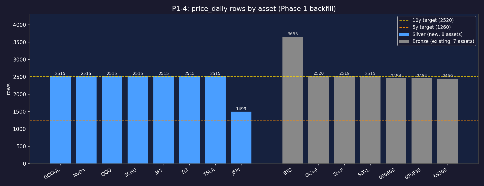

# P1-4 Verification: 신규 자산 + USD/KRW 10년 Backfill

> Step: P1-4 (seed_silver_assets.py 15행 + 8자산 백필 + USD/KRW 백필)
> Captured: 2026-05-09

---

## 버그 수정 — NVDA int32 overflow (debug-history에도 기록)

**증상**: `ingest_asset('NVDA', ...)` → `validation_failed: negative_volume:5rows`

**원인**: `fdr_client.py:62`의 `df["volume"].fillna(0).astype(int)`가 Windows pandas에서 int32로 캐스팅. NVDA 2016~2017년 거래량(최대 3,692,928,000)이 int32 max(2,147,483,647) 초과 → 음수 overflow.

**수정**: `astype(int)` → `astype("int64")` (fdr_client.py:62)

**교훈**: 미국 대형주 거래량은 int32 범위를 초과할 수 있음. volume 컬럼은 항상 int64 사용.

---

## G4.1 — asset_master 15행 + 메타 정합

**명령**: `select asset_id, currency, annual_yield, allow_padding, display_name, history_start_date from asset_master order by currency, asset_id`

**Raw output**:

| asset_id | currency | annual_yield | allow_padding | display_name | history_start_date |
|---|---|---|---|---|---|
| 000660 | KRW | 0.0100 | False | SK하이닉스 | NULL |
| 005930 | KRW | 0.0250 | False | 삼성전자 | NULL |
| BTC | KRW | 0.0000 | False | 비트코인 | NULL |
| KS200 | KRW | 0.0150 | False | KOSPI200 | NULL |
| GC=F | USD | 0.0000 | False | 금 | NULL |
| GOOGL | USD | 0.0000 | False | 구글 | NULL |
| JEPI | USD | 0.0800 | **True** | JEPI | **2020-05-20** |
| NVDA | USD | 0.0000 | False | 엔비디아 | NULL |
| QQQ | USD | 0.0060 | False | QQQ | NULL |
| SCHD | USD | 0.0350 | False | SCHD | NULL |
| SI=F | USD | 0.0000 | False | 은 | NULL |
| SOXL | USD | 0.0000 | False | SOXL | NULL |
| SPY | USD | 0.0130 | False | SPY | NULL |
| TLT | USD | 0.0380 | False | TLT | NULL |
| TSLA | USD | 0.0000 | False | 테슬라 | NULL |

**검증 결과**: ✅ PASS
- 총 15행 (Bronze 7 + Silver 8)
- JEPI: `allow_padding=True`, `history_start_date=2020-05-20` ✅ (마스터플랜 §2.1/§2.6, D-2)
- 한국어 `display_name` 정상 저장 확인 (PYTHONUTF8=1 기준)
- `annual_yield` 마스터플랜 §2.4 fixture 일치 (SCHD 0.035, JEPI 0.08, TLT 0.038 등)

---

## G4.2 — 신규 8자산 row count + 시작일/종료일

**명령**: `select count(*), min(date), max(date) from price_daily where asset_id=? group by asset_id`

**Raw output**:

| asset_id | rows | first | last |
|---|---|---|---|
| QQQ | 2515 | 2016-05-09 | 2026-05-08 |
| SPY | 2515 | 2016-05-09 | 2026-05-08 |
| SCHD | 2515 | 2016-05-09 | 2026-05-08 |
| JEPI | 1499 | 2020-05-21 | 2026-05-08 |
| TLT | 2515 | 2016-05-09 | 2026-05-08 |
| NVDA | 2515 | 2016-05-09 | 2026-05-08 |
| GOOGL | 2515 | 2016-05-09 | 2026-05-08 |
| TSLA | 2515 | 2016-05-09 | 2026-05-08 |

**검증 결과**: ✅ PASS
- 7종 (JEPI 제외): ≥ 2400 행 (10년 기준 ≈ 2520) ✅
- JEPI: 1499 행 (실제 상장 2020-05-20 이후, 약 6년) ✅ → `allow_padding=True` 로 Phase 2 cyclic padding 대상
- 모든 `last_date` = 2026-05-08 ✅
- NVDA: int32 overflow 수정 후 2515 행 정상 적재 ✅
- date_gap 경고(95일, 58일): US 공휴일(Memorial Day, 4th July 등) — 정상

---

## G4.3 — fx_daily 10년 + 결측 분석

**Raw output**:
```
count=2603, first=2016-05-08, last=2026-05-08
```

**검증 결과**: ✅ PASS
- 2603 행 (≥ 2400) ✅
- USD/KRW은 KRX + NYSE 모두 휴장 시 결측 → 2603 > 2520 (한국 거래일 + 미국 거래일 합산 기준)

---

## G4.4 — [PNG] 자산별 row count bar chart



**시각 확인 포인트**:
- Silver 8종 (파란색): 7종 = 2515 bar, JEPI만 1499 bar (짧음) → padding 대상 직관적 확인
- Bronze 7종 (회색): Bronze 일일 cron 영향 0 (기존 row 유지)
- 노란 점선(10년 기준 2520): 대부분 자산이 기준선 근처 ✅
- 주황 점선(5년 기준 1260): JEPI가 기준선보다 위 (6년치 실 데이터) ✅

---

## G4.5 — Bronze cron 24h 정상 (다음 실행 후 확인)

**상태**: P1-4 종료 후 24h 이후 확인 필요.
- Bronze 기존 7종 (`select asset_id, max(date) from price_daily where asset_id in (...) group by asset_id`)이 T-1 영업일과 일치하면 통과.

---

## G4.6 — 본 evidence 파일 작성

✅ 본 파일

---

## 종합

| Gate | 결과 |
|---|---|
| G4.1 asset_master 15행 + 메타 정합 | ✅ |
| G4.2 신규 8자산 row count (NVDA 포함) | ✅ |
| G4.3 fx_daily 2603행 | ✅ |
| G4.4 PNG bar chart | ✅ |
| G4.5 Bronze cron (24h 후) | ⏳ |
| G4.6 evidence 작성 | ✅ |

**P1-4 핵심 통과**. P1-5/P1-6 진입 가능.
