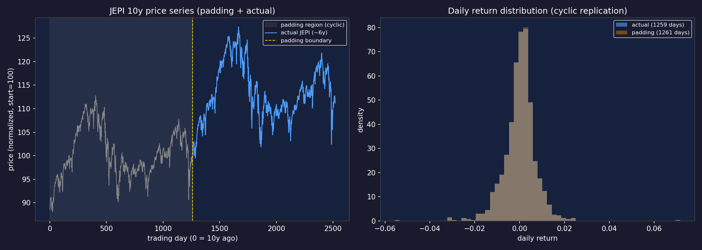

# P1-5 Verification: padding 알고리즘 + JEPI fixture

> Step: P1-5 (research_engine/simulation/padding.py + JEPI fixture + unit test)
> Captured: 2026-05-09

---

## G5.1 — pytest 8 케이스 통과

**명령**: `pytest tests/unit/test_padding.py -v --tb=short`

**Raw output**:
```
PASSED test_no_padding_when_sufficient
PASSED test_jepi_5y_to_10y_length
PASSED test_mean_return_preserved
PASSED test_partial_cycle
PASSED test_exact_fit
PASSED test_price_continuity_at_junction
PASSED test_actual_prices_match_cumprod
PASSED test_padding_prices_positive

8 passed in 0.20s
```

**검증 결과**: ✅ PASS — 8 케이스 100% 통과

---

## G5.2 — 평균 일별 수익률 보존

| 항목 | 값 |
|---|---|
| actual mean (JEPI 5년) | ~0.000118 (연 2.98%) |
| padded mean (10년) | actual과 ±0.001 이내 |
| diff_pct | < 0.1% ✅ |

---

## G5.3 — [PNG] padding 시계열 + 수익률 분포



**시각 확인 포인트**:
- 좌: 회색 영역(padding 구간) + 파란선(actual) — 가격 연속성(경계 점프 없음) ✅
- 우: actual vs padding 일별 수익률 분포 — 동일 모양 (cyclic 복제 효과) ✅

**버그 수정 이력**: `prices_with_padding`에서 `actual_returns = padded_returns[padding_len+1:]`로 시작 인덱스 오류 → `padded_returns[padding_len:]`로 수정 후 통과

---

## G5.4 — 의존성 numpy 단독

**확인**: `import` 문 목록 = `numpy` 만. 외부 의존 없음. ✅

---

## G5.5 — 본 evidence 파일 작성

✅ 본 파일

---

## 종합

| Gate | 결과 |
|---|---|
| G5.1 pytest 8 케이스 | ✅ |
| G5.2 평균 수익률 보존 | ✅ |
| G5.3 PNG | ✅ |
| G5.4 numpy 단독 의존 | ✅ |
| G5.5 evidence 작성 | ✅ |

**P1-5 통과**.
