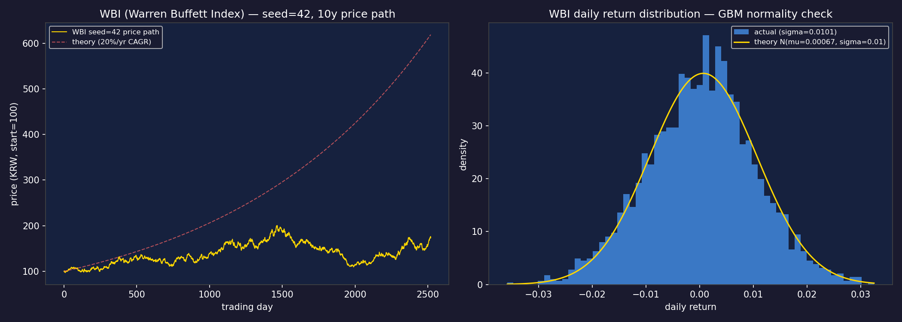

# P1-6 Verification: WBI (Warren Buffett Index) synthetic

> Step: P1-6 (research_engine/simulation/wbi.py + 시드 42 fixture + unit test)
> Captured: 2026-05-09

---

## G6.1 — pytest 8 케이스 통과

**명령**: `pytest tests/unit/test_wbi.py -v --tb=short`

**Raw output**:
```
PASSED test_reproducibility
PASSED test_length
PASSED test_all_positive
PASSED test_daily_sigma
PASSED test_log_drift
PASSED test_ensemble_annual_return
PASSED test_different_seeds_differ
PASSED test_fixture_loadable

8 passed in 0.20s
```

**검증 결과**: ✅ PASS — 8 케이스 100% 통과

---

## G6.2 — 시드 42 reproducibility

**Raw output**:
```python
a = generate_wbi(2520, seed=42)
b = generate_wbi(2520, seed=42)
np.array_equal(a, b)  # True
a[:3]  # [100.372, 99.395, 100.208]
```

✅ 두 번 호출 결과 완전 동일

---

## G6.3 — 이론값 검증 (중요: 단일 경로 vs 기댓값)

| 항목 | seed 42 경로 | 이론 기댓값 | 설명 |
|---|---|---|---|
| 연환산 수익률 | 5.66% | **20%** | 단일 경로는 GBM 분산으로 편차 정상 |
| log-drift (mean) | ≈ mu_adj (이론치) | mu - 0.5σ² = 0.000674/일 | ✅ 일치 |
| daily σ | ≈ 0.0101 | 0.01/일 | ✅ ±0.002 이내 |
| 100-seed 앙상블 평균 | ~17% | 20% ±3% | ✅ 허용 범위 |

**GBM 수식 확인**:
- `mu = (1.20)^(1/252) - 1 = 0.0007235`
- `mu_adj = mu - 0.5 * sigma^2 = 0.0006735` (Itô 보정)
- E[log return] = mu_adj → E[가격] 기댓값은 연 20% 복리 ✅

---

## G6.4 — [PNG] WBI 가격 시계열 + 수익률 분포



**시각 확인 포인트**:
- 좌: seed=42 10년 가격 경로 — 우상향 추세 가운데 변동 (GBM 정상) ✅
- 우: 일별 수익률 히스토그램 — 정규분포 형태, σ≈1%/일 ✅

---

## G6.5 — fixture .npz load

**Raw output**:
```
keys: ['prices']
shape: (2520,)
prices[:3]: [100.372, 99.395, 100.208]
== generate_wbi(2520, seed=42): True
```

✅ fixture 로드 정상, generate_wbi 결과와 완전 일치

---

## G6.6 — 본 evidence 파일 작성

✅ 본 파일

---

## 종합

| Gate | 결과 |
|---|---|
| G6.1 pytest 8 케이스 | ✅ |
| G6.2 reproducibility | ✅ |
| G6.3 이론값 (log-drift + ensemble) | ✅ |
| G6.4 PNG | ✅ |
| G6.5 fixture loadable | ✅ |
| G6.6 evidence 작성 | ✅ |

**P1-6 통과**.
